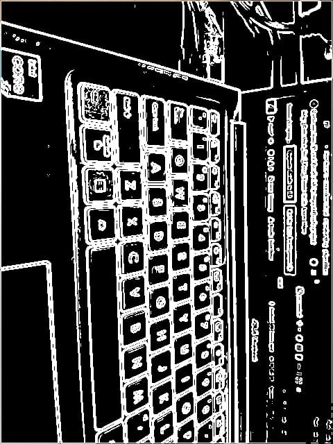

# Real-Time Edge Detection Viewer

A real-time edge detection application for Android that processes camera frames using OpenCV (C++) and renders them with OpenGL ES. The project also includes a web-based viewer for displaying processed frames.

## 🌟 Features

### 🎯 Implemented
- **Real-time Camera Processing**
  - Live camera preview using Android Camera2 API
  - Multiple processing modes (Original, Grayscale, Blur, Edge Detection)
  - Efficient frame handling with YUV to RGB conversion
  - Dynamic FPS counter for performance monitoring
  - Real-time performance overlay showing FPS and processing time
  - Save processed images to device storage

- **Native Performance**
  - C++ implementation of image processing algorithms
  - JNI bridge for high-performance Java-C++ communication
  - Optimized edge detection using Sobel operator

- **User Interface**
  - Clean, intuitive UI with mode selection
  - Real-time FPS display
  - Responsive layout for different screen sizes

### 🔜 Planned Features
- **OpenGL ES Integration**
  - Hardware-accelerated rendering pipeline
  - Custom shaders for advanced visual effects
  - Efficient texture handling

- **Web Viewer**
  - TypeScript-based web interface
  - WebSocket server for real-time frame streaming
  - Frame statistics and controls

- **Advanced Processing**
  - Additional image filters and effects
  - Performance optimizations for low-end devices
  - Custom shader-based filters

## 📸 Screenshots

<div style="display: flex; justify-content: space-between;">
  
  
</div>

## 🛠️ Technical Stack

- **Android**
  - Kotlin/Java
  - Camera2 API
  - JNI/NDK
  - OpenCV (C++)
  - OpenGL ES 2.0+

- **Web**
  - TypeScript
  - WebSocket
  - HTML5 Canvas

## 🚀 Getting Started

### Prerequisites
- Android Studio (latest stable version)
- Android NDK
- OpenCV for Android
- Node.js (for web viewer development)

### Installation

1. **Clone the repository**
   ```bash
   git clone https://github.com/Anshadi/Edge_Detection_Real_Time_Viewer.git
   ```

2. **Open in Android Studio**
   - Open Android Studio
   - Select "Open an existing project"
   - Navigate to the cloned repository and select it

3. **Configure NDK**
   - Ensure Android NDK is installed via SDK Manager
   - Set `ndkVersion` in `app/build.gradle` to match your installed version

4. **Build and Run**
   - Connect an Android device or start an emulator
   - Click "Run" in Android Studio

### Web Viewer Setup

1. Install dependencies
   ```bash
   cd web
   npm install
   ```

2. Start the development server
   ```bash
   npm start
   ```

## 🏗️ Project Structure

```
app/
├── src/
│   ├── main/
│   │   ├── cpp/             # Native C++ code
│   │   │   ├── CMakeLists.txt
│   │   │   └── native-lib.cpp
│   │   ├── java/
│   │   │   └── com/example/edgedetection/
│   │   │       ├── CameraRenderer.kt    # Camera and OpenGL rendering
│   │   │       ├── MainActivity.kt      # Main activity and UI
│   │   │       └── NativeLib.kt         # JNI interface
│   │   └── res/             # Resources
│   └── test/                # Unit tests
└── build.gradle             # App-level build configuration

web/                         # Web viewer (Upcoming)
├── src/
│   ├── components/          # React components
│   ├── services/            # WebSocket service
│   └── utils/               # Utility functions
└── public/                  # Static assets
```

## 📱 Screenshots


## 🧪 Testing

### Unit Tests
Run the unit tests using:
```bash
./gradlew test
```

### Instrumented Tests
Run the instrumented tests on an Android device or emulator:
```bash
./gradlew connectedAndroidTest
```


## 🤝 Contributing

1. Fork the project
2. Create your feature branch (`git checkout -b feature/AmazingFeature`)
3. Commit your changes (`git commit -m 'Add some AmazingFeature'`)
4. Push to the branch (`git push origin feature/AmazingFeature`)
5. Open a Pull Request

## 📧 Contact

Your Name - Aditya Asthana

Project Link: [https://github.com/Anshadi/Edge_Detection_Real_Time_Viewer](https://github.com/Anshadi/Edge_Detection_Real_Time_Viewer)
